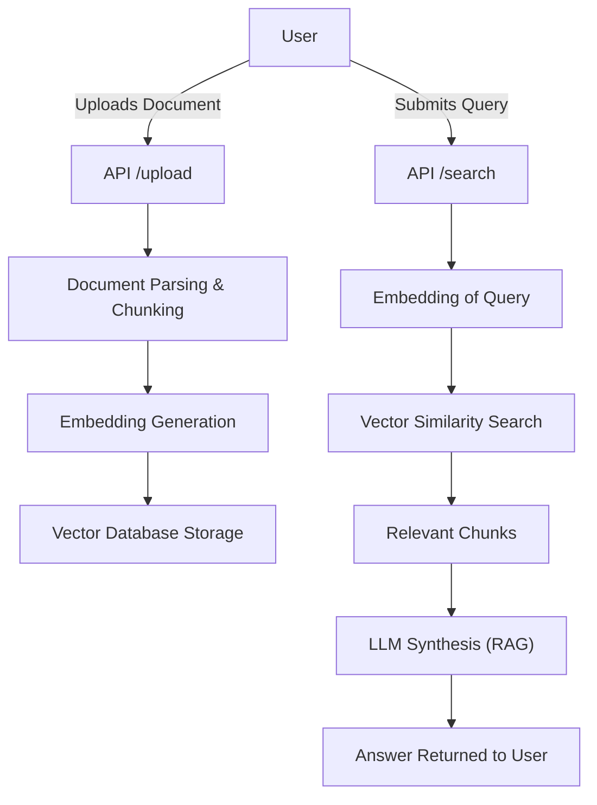

# AI-powered RAG Document Assistant

AI-powered RAG Document Assistant is an open-source solution that leverages Retrieval-Augmented Generation (RAG) to enhance document understanding and automation with AI. It seamlessly integrates vector search, natural language processing, and modern backend technologies to deliver intelligent document management, search, and summarization.

---

## Introduction

This project provides a robust framework for building AI-driven document assistants. It allows users to upload, index, search, and interact with documents using advanced language models. The assistant uses RAG techniques to combine AI-generated reasoning with efficient retrieval from document collections, delivering accurate, context-aware answers and summaries.

---

## Features

- **RAG Pipeline**: Utilizes Retrieval-Augmented Generation for informed, accurate responses.
- **Document Upload & Indexing**: Supports various document types for ingestion and vectorization.
- **Semantic Search**: Retrieve relevant passages and answers with natural language queries.
- **Summarization**: Generate concise summaries of documents or extracted sections.
- **Pluggable Embeddings**: Easily switch or upgrade language model and vector backend.
- **Extensible Architecture**: Modular design for easy integration and extension.

---

## Requirements

To run the AI-powered RAG Document Assistant, ensure your environment includes:

- Python 3.8+
- pip (Python package manager)
- Node.js (for frontend, if applicable)
- Docker (optional, for containerized deployment)
- Supported vector database (e.g., Pinecone, FAISS, Weaviate, Chroma)
- Access to OpenAI API or other language models (for LLM integration)

## Installation

Follow these steps to set up the project locally:

1. **Clone the Repository**

    ```bash
    git clone https://github.com/Emanuel181/AI-powered_RAG_document_assistant.git
    cd AI-powered_RAG_document_assistant
    ```

2. **Install Python Dependencies**

    It is recommended to use a virtual environment:

    ```bash
    python -m venv venv
    source venv/bin/activate
    pip install -r requirements.txt
    ```

3. **Set Environment Variables**

    Create a `.env` file in the project root with your configuration:

    ```
    OPENAI_API_KEY=your_openai_api_key
    ```

## Usage

After installation, you can interact with the assistant via REST API or the provided user interface. The basic workflow typically involves:

- Uploading documents to the system
- Allowing the assistant to index and vectorize content
- Submitting queries to retrieve relevant information or summaries

### Example Workflow

1. **Upload a Document**

    Use the `/upload` endpoint to send your document for indexing.

2. **Ask a Question**

    Query the `/search` endpoint with your question. The assistant retrieves relevant document chunks and generates a coherent response.

3. **Get Summaries**

    Use the `/summarize` endpoint to obtain concise summaries of uploaded documents.

---

### API Endpoints

#### Upload Document (`POST /upload`)

```api
{
    "title": "Upload Document",
    "description": "Upload a document file to be indexed and stored.",
    "method": "POST",
    "baseUrl": "http://localhost:8000",
    "endpoint": "/upload",
    "headers": [
        {
            "key": "Authorization",
            "value": "Bearer <token>",
            "required": true
        }
    ],
    "queryParams": [],
    "pathParams": [],
    "bodyType": "form",
    "formData": [
        {
            "key": "file",
            "value": "Document file to upload",
            "required": true
        }
    ],
    "responses": {
        "200": {
            "description": "Document uploaded successfully.",
            "body": "{\n  \"message\": \"Upload successful\",\n  \"document_id\": \"123abc\"\n}"
        },
        "400": {
            "description": "Invalid file format or request.",
            "body": "{\n  \"error\": \"Invalid file type.\"\n}"
        }
    }
}
```

#### Search Documents (`POST /search`)

```api
{
    "title": "Search Documents",
    "description": "Submit a query and retrieve relevant document passages with AI-generated answers.",
    "method": "POST",
    "baseUrl": "http://localhost:8000",
    "endpoint": "/search",
    "headers": [
        {
            "key": "Authorization",
            "value": "Bearer <token>",
            "required": true
        }
    ],
    "queryParams": [],
    "pathParams": [],
    "bodyType": "json",
    "requestBody": "{\n  \"query\": \"What is the main topic of the document?\"\n}",
    "responses": {
        "200": {
            "description": "Relevant passages and AI answer returned.",
            "body": "{\n  \"answer\": \"The document discusses...\",\n  \"sources\": [\n    {\"chunk\": \"...\", \"document_id\": \"123abc\"}\n  ]\n}"
        }
    }
}
```

#### Summarize Document (`POST /summarize`)

```api
{
    "title": "Summarize Document",
    "description": "Generate a summary for a specific uploaded document.",
    "method": "POST",
    "baseUrl": "http://localhost:8000",
    "endpoint": "/summarize",
    "headers": [
        {
            "key": "Authorization",
            "value": "Bearer <token>",
            "required": true
        }
    ],
    "queryParams": [],
    "pathParams": [],
    "bodyType": "json",
    "requestBody": "{\n  \"document_id\": \"123abc\"\n}",
    "responses": {
        "200": {
            "description": "Summary generated successfully.",
            "body": "{\n  \"summary\": \"This document covers...\"\n}"
        }
    }
}
```

---

### Example Data Flow



---

## License

This project is licensed under the MIT License. You are free to use, modify, and distribute it with attribution to the original authors.

---

## Contributing

We welcome contributions to enhance features, fix bugs, or improve documentation.

- Fork the repository and create your branch.
- Make your changes and write clear commit messages.
- Ensure code passes all tests and adheres to project style guidelines.
- Submit a pull request with a detailed description of your changes.

Please refer to any `CONTRIBUTING.md` file for detailed guidelines.

---

## Contact & Support

For questions or issues, please open an issue on the GitHub repository or contact the maintainers via the issue tracker.

---

## Acknowledgements

This project leverages open-source technologies including FastAPI, LangChain, and leading vector databases to deliver a powerful document assistant experience.

---
